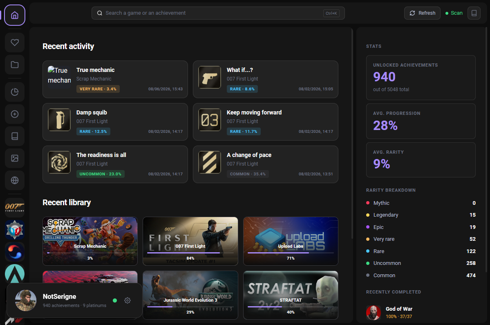
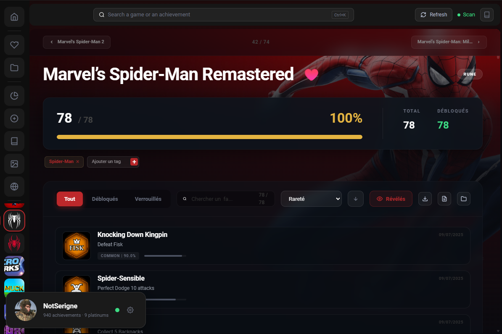
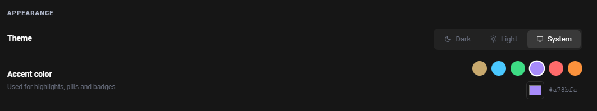
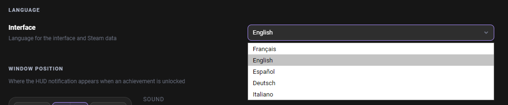

<div align="center">
  

  # Accolade

  **Give your achievements a second life.**

  [](https://github.com/NotSerigne/Accolade/releases/latest)
  [](https://github.com/NotSerigne/Accolade/releases)
  [](LICENSE)
  [](https://tauri.app/)
  [](https://svelte.dev/)
  [](https://www.rust-lang.org/)

  _A Windows app that tracks and displays your achievements from emulated games — with real-time overlay notifications, stats, and a clean modern UI._

  [Download](#-download) • [Features](#-features) • [Supported Emulators](#-supported-emulators) • [Setup](#-setup) • [Contributing](#-contributing)

</div>

---

## ⬇️ Download

Head to the [**Releases**](https://github.com/NotSerigne/Accolade/releases/latest) page and grab the `.msi` installer or the `.exe` setup.

> **Requirements**: Windows 10 / 11 (64-bit). WebView2 is usually already installed; if not, Windows will prompt you automatically.

## ✨ Features

- 🔍 **Auto-detection** — Automatically scans and parses achievements for all supported emulators and Steam.
- 🔔 **Real-time overlay** — In-game notifications the moment an achievement unlocks, no alt-tab needed.
- 🖼️ **Steam metadata** — Names, descriptions, icons and rarity pulled straight from the Steam API.
- 🎨 **Fully customizable** — Light / Dark / System theme, accent color, notification sounds.
- 📊 **Stats & journal** — Progress overview, favorites, tags and personal objectives.
- 📸 **Auto screenshots** — Captures a screenshot on every achievement unlock.
- 🌍 **Multi-language** — UI available in EN, FR, ES, DE, IT.
- 🚀 **Launch with Windows** — Silent tray mode on startup.
- ⚡ **Lightweight** — Rust core via Tauri v2.

---

## 📸 Screenshots

<p align="center">
  
</p>

<table>
<tr>
<td></td>
<td></td>
</tr>
</table>

<details>
<summary>More screenshots</summary>



</details>
  
---

## 🕹️ Supported Emulators

| Emulator | Default location |
| :--- | :--- |
| **Goldberg** | `%APPDATA%\Goldberg SteamEmu Saves` or `%APPDATA%\GSE Saves` |
| **Empress** | `%APPDATA%\Empress-Emulator` |
| **CODEX** | `%APPDATA%\Steam\CODEX` |
| **OnlineFix** | `%PUBLIC%\Documents\OnlineFix` |
| **RUNE** | `%PUBLIC%\Documents\Steam\RUNE` |

---

## ⚙️ Setup

On first launch, a setup wizard will guide you through the configuration. You'll need:

| Setting | Required | How to get it |
| :--- | :---: | :--- |
| **Steam ID** (64-bit) | ✅ | [steamid.io](https://steamid.io) or your Steam profile URL |
| **Steam API Key** | ✅ | [steamcommunity.com/dev/apikey](https://steamcommunity.com/dev/apikey) |
| **SteamGridDB API Key** | ⬜ | [steamgriddb.com/profile/preferences/api](https://www.steamgriddb.com/profile/preferences/api) — improves icon quality |

> **Game folders**: add the root folders where your games are installed. Accolade will automatically look for achievement files in all known emulator locations.

---

## 🛠️ Build from source

You'll need [Node.js 20+](https://nodejs.org/), [Rust](https://www.rust-lang.org/tools/install) and the [Tauri CLI](https://tauri.app/start/prerequisites/).

```bash
git clone https://github.com/NotSerigne/Accolade.git
cd Accolade
npm install

# Development (hot-reload)
npm run tauri dev

# Release build (installer output in src-tauri/target/release/bundle/)
npm run tauri build
```

---

## 🤝 Contributing

Contributions are welcome! To report a bug or suggest a feature, open an [Issue](https://github.com/NotSerigne/Accolade/issues/new/choose) using the appropriate template.

To submit code:

1. Fork the project
2. Create a branch (`git checkout -b feature/my-feature`)
3. Commit your changes
4. Open a Pull Request

> 🇫🇷 The developer is French — feel free to open issues or discussions in French too.

---

## 📔Legal
⚠️ The software offered here is solely for informational purposes and does not facilitate or promote unauthorized access to copyrighted content.

Use of the software given here is at your own risk. There is no explicit or implicit warranty; this is offered just as is.
The authors and firm disclaim all liability for any harm that may occur to you or your computer as a result of installing or using the free software and its accompanying documentation on this website.
And for anything that might happen as a result of using or not being able to use the resources on this website.

No cracking scene groups are connected to or involved with the software offered here.

Software provided here is not affiliated nor associated with Steam, © Valve Corporation, Uplay, © Ubisoft and data from theirs API is provided as is without any express or implied warranty.

The software offered here is not connected to Steam or copyright Valve Corporation, and information from their API is given without any kind of explicit or implicit guaranty.

Copyright and other trademarks belong to their respective owners. The use of third-party resources is not meant to violate any copyright or trademark. The materials of this project are protected by copyright, unless otherwise noted.

---

## 📄 License

Distributed under the [MIT License](LICENSE). © 2025 NotSerigne.

---

<div align="center">
  <sub>Accolade is not affiliated with Valve, Steam, or any game publisher.</sub>
</div>
